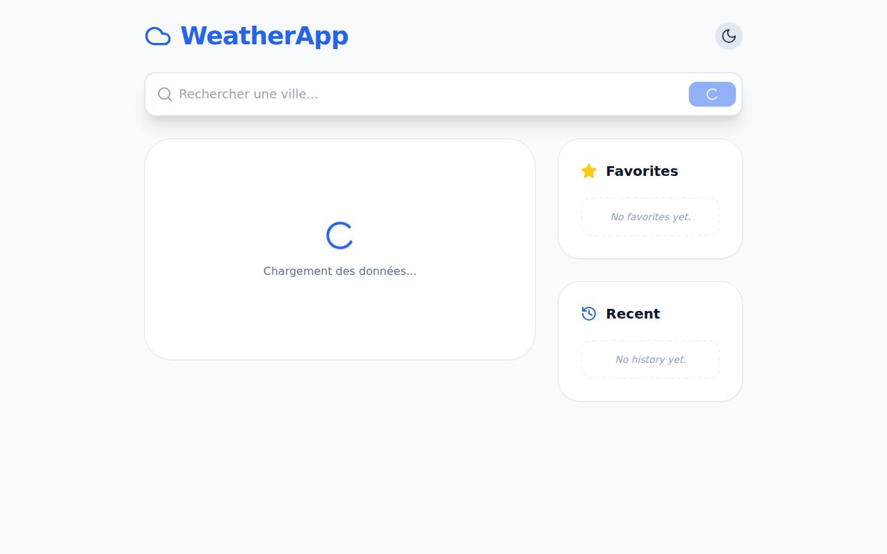

# Advanced Weather App (Vue.js 3 + Pinia + Tailwind)



A professional-grade, modern, and responsive weather application built with Vue.js 3, Pinia, and Tailwind CSS.

## Features

- **🔍 Smart Autocomplete:** City search with dynamic suggestions and debounced input.
- **🕘 Search History:** Automatically saves the last 5 searched cities (persisted in LocalStorage).
- **⭐ Favorites Management:** Add/remove cities to your favorites for quick access (persisted in LocalStorage).
- **⚡ Performance Optimized:** Lazy loading of pages/components and code splitting via Vue Router.
- **🎨 Modern UI/UX:**
  - SaaS-style design with Tailwind CSS.
  - Fully responsive (mobile-first).
  - Smooth transitions and animations.
  - **Dark Mode** support with toggle.
- **🌐 Robust API Integration:** Centralized weather data fetching using Axios.

## Tech Stack

- **Frontend:** Vue.js 3 (Composition API)
- **State Management:** Pinia
- **Styling:** Tailwind CSS + Lucide Icons
- **Build Tool:** Vite
- **API:** WeatherAPI.com

## Getting Started

### Prerequisites

- [Node.js](https://nodejs.org/) (v16+)
- npm / yarn / pnpm

### Installation

1. Clone the repository:
   ```bash
   git clone <repository-url>
   cd weatherapp
   ```

2. Install dependencies:
   ```bash
   npm install
   ```

3. Run the development server:
   ```bash
   npm run dev
   ```

### Building for Production

To generate a production build:

```bash
npm run build
```

The output will be in the `dist/` directory.

---
Developed as an advanced showcase of Vue.js 3 best practices.
